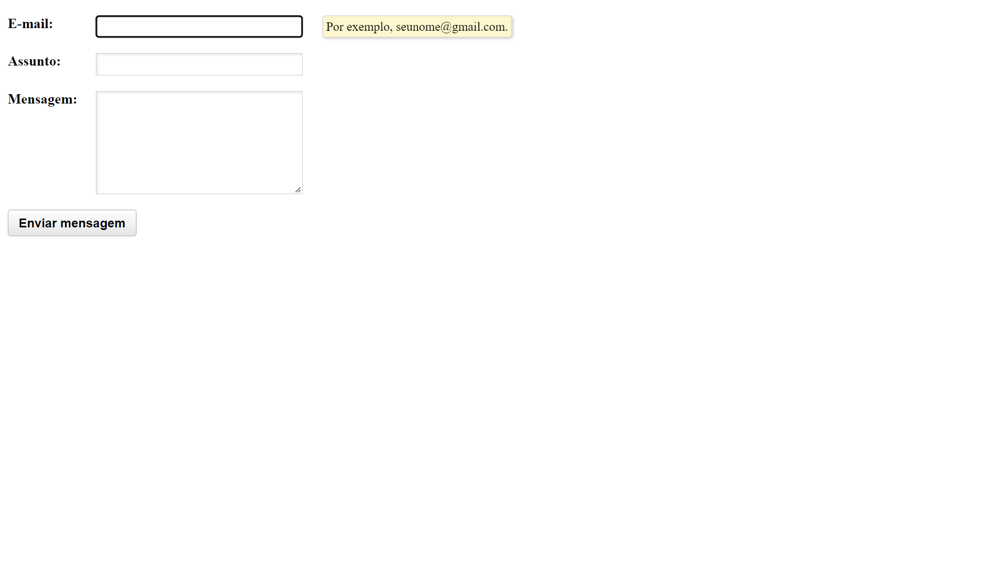
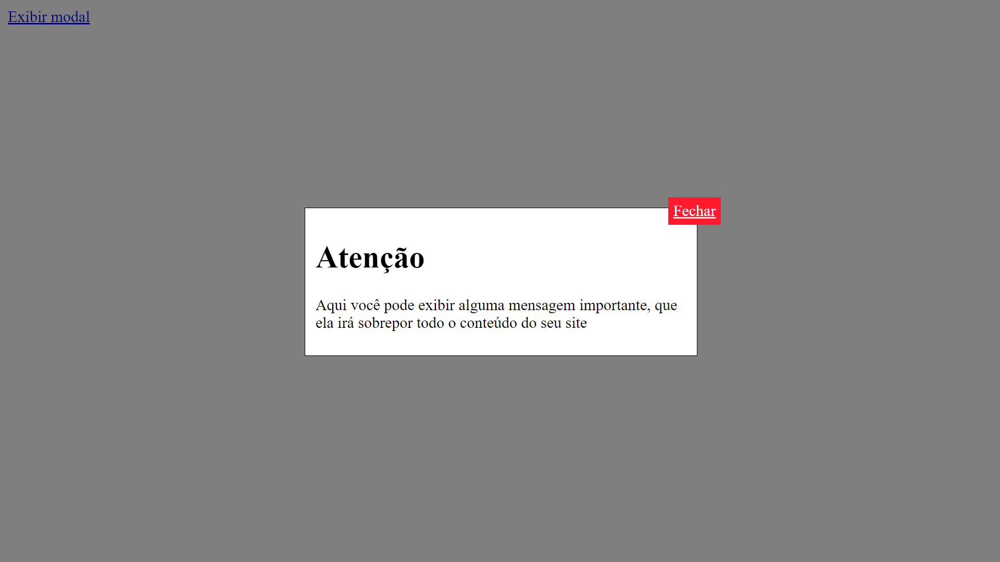
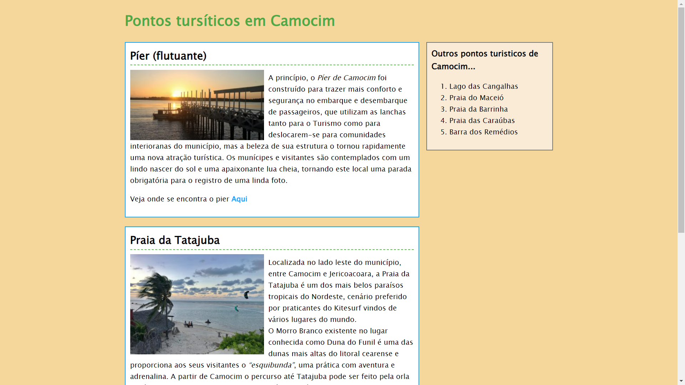
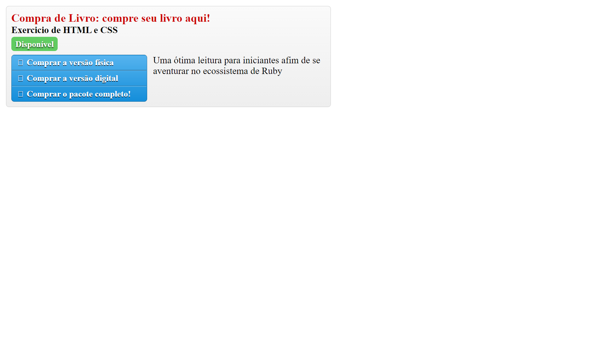
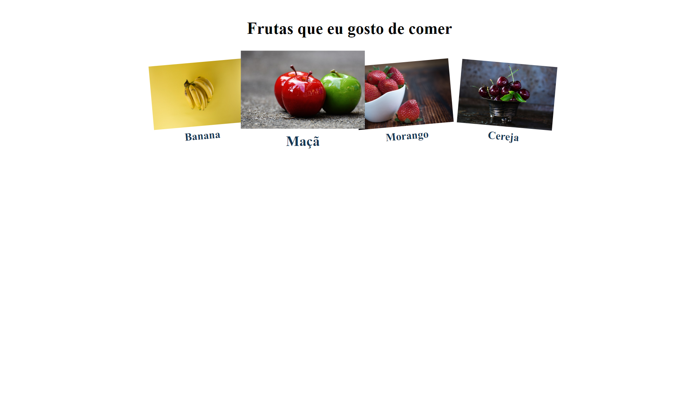
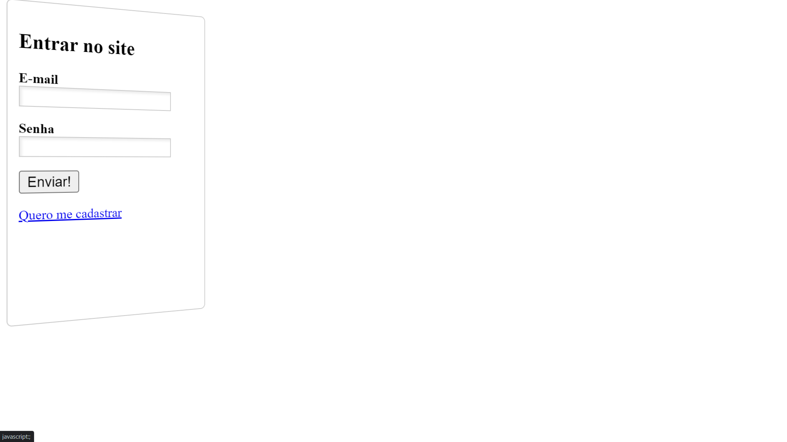

## Table of contents

- [criando-formulario](#criando-formulario)
  - [Screenshot](#screenshot)
  - [Link](#link)
- [janela-modal](#janela-modal)
  - [Screenshot](#screenshot)
  - [Link](#link)
- [placeholder](#placeholder)
  - [Screenshot](#screenshot)
  - [Link](#link)
- [primeiro-projeto](#primeiro-projeto)
  - [Screenshot](#screenshot)
  - [Link](#link)
- [ruby-on-rails](#ruby-on-rails)
  - [Screenshot](#screenshot)
  - [Link](#link)
- [transformando-elementos](#transformando-elementos)
  - [Screenshot](#screenshot)
  - [Link](#link)
- [formulario-com-transicao](#formulario-com-transicao)
  - [Screenshot](#screenshot)
  - [Link](#link)

## criando-formulario

### Screenshot

### Link

- Live Site URL: [live site URL](https://theuz1nh0.github.io/HTML5-e-CSS3-Domine-a-web-do-futuro/criando-formulario/)

## janela-modal

### Screenshot

### Link

- Live Site URL: [live site URL](https://theuz1nh0.github.io/HTML5-e-CSS3-Domine-a-web-do-futuro/janela-modal/)

## placeholder

### Screenshot

### Link

- Live Site URL: [live site URL](https://theuz1nh0.github.io/HTML5-e-CSS3-Domine-a-web-do-futuro/placeholder/)

## primeiro-projeto

### Screenshot

### Link

- Live Site URL: [live site URL](https://theuz1nh0.github.io/HTML5-e-CSS3-Domine-a-web-do-futuro/primeiro-projeto/)

## ruby-on-rails

### Screenshot

### Link

- Live Site URL: [live site URL](https://theuz1nh0.github.io/HTML5-e-CSS3-Domine-a-web-do-futuro/ruby-on-rails/)

## transformando-elementos

### Screenshot

### Link

- Live Site URL: [live site URL](https://theuz1nh0.github.io/HTML5-e-CSS3-Domine-a-web-do-futuro/transformando-elementos/)

## formulario-com-transicao-3d

### Screenshot

### Link

- Live Site URL: [live site URL](https://theuz1nh0.github.io/HTML5-e-CSS3-Domine-a-web-do-futuro/formulario-com-transicao-3d/)
